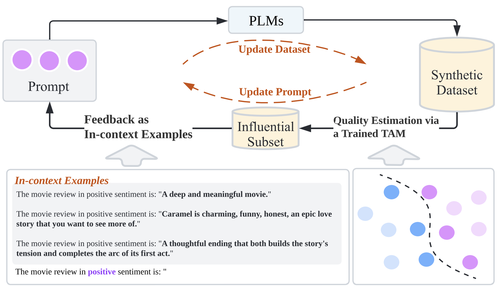

# P<small>RO</small>G<small>EN</small>
This repository contains the code for our paper [“ProGen: Progressive Zero-shot Dataset Generation via In-context Feedback”](https://arxiv.org/abs/2210.12329).

The implementation is built on the source code from [ZeroGen](https://github.com/jiacheng-ye/ZeroGen).

If you use this code, please cite our paper:

```
@inproceedings{ye-etal-2022-progen,
    title = "{P}ro{G}en: Progressive Zero-shot Dataset Generation via In-context Feedback",
    author = "Ye, Jiacheng  and
      Gao, Jiahui  and
      Wu, Zhiyong  and
      Feng, Jiangtao  and
      Yu, Tao  and
      Kong, Lingpeng",
    booktitle = "Findings of the Association for Computational Linguistics: EMNLP 2022",
    month = dec,
    year = "2022",
    address = "Abu Dhabi, United Arab Emirates",
    publisher = "Association for Computational Linguistics",
    url = "https://aclanthology.org/2022.findings-emnlp.269",
    pages = "3671--3683"
}
```

## Setup
All requirements for P<small>RO</small>G<small>EN</small> can be found in ``requirements.txt``. 
You can install all required packages in a new environment with ``pip install -r requirements.txt``.

## Usage
The `scripts/run_main.sh` scripts contain the running commands for the following methods:
- S<small>UPERVISED</small>: supervised learning with human annotations;
- P<small>ROMPTING</small>: prompt-based zero-shot learning;
- P<small>ROMPTING*</small>: prompt-based zero-shot learning with calibration by setting `--calibrate` in prompting;
- Z<small>ERO</small>G<small>EN</small>: efficient zero-shot learning via dataset generation by setting `in_context_type=none`;
- P<small>RO</small>G<small>EN</small>: progressive dataset generation via in-context feedback.
 
We track the performance of the small model in the data generation procedure. Before running, you need to reset the following parameters to yours:
- `batch_size`: the batch size for generating with PLM. For SST-2, it costs ~16G when using a batch size of 32 with gpt2-xl. So decrease the batch size if needed;
- `WANDB_PROJECT`: project name, by default `ProGen`;
- `WANDB_ENTITY`: your wandb username;
- `WANDB_API_KEY`: your api-key.

By default we use GPT2-XL as pre-trained language model (PLM) and DistilBERT as tiny-task model (TAM), 
to modify the size of PLM and TAM, you can change `model_name` and `small_model_name` in `run_main.sh` scripts.
We also include the API-based inference, i.e., OPT 175B, where we generate dataset through a black-box API. 

### Run with a synthesized dataset
After dataset generation, we save the synthetic dataset at `out-${task_name}-x2/${dataset}/${task_name}-dataset.jsonl`. The file is in json line format (e.g., `{"C": "The Book of Mormon Musical", "X": "The Book of Mormon Musical brings all the drama and excitement of a real revival of the Broadway production to the big screen.", "Y": 0}`).

To run DistilBERT or LSTM given a generated dataset, you can use the `scripts/run_tam_training.sh` script. 

### Experiments of Influence Function
To experiment the effectiveness of influence function when the validation set is noisy, run `bash scripts/run_IF_exp.sh`.
You can see the effectiveness of IF is highly affected by the noise of the validation set (Paper Fig.6), and using RCE as loss function reduces such effect.